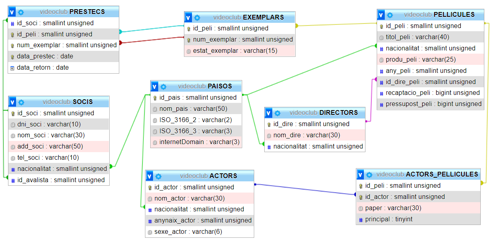

Activitat:

1) Fer un clone del meu repositori
https://github.com/joanpardogine/MP02_UF02_ActitvitatNouVideoclub

2) Crear un repositori CognomNom_ActitvitatNouVideoclub al vostre github.

3) Convidar a joanpardogine

4) Cal crear el vostre README.md de zero explicant pas a pas que és que feu a cada punt.

5) Crear un fitxer nouVideoclub.sql a on afegiu tota la informació per crear la base de dades i afegir tota la informació que hi havia a l'anterior base de dades.


# Modificar base de dades **```videoclub```**.



# TAULES

```sql
show tables;
-- +---------------------+
-- | Tables_in_videoclub |
-- +---------------------+
-- | ACTORS              |
-- | ACTORS_PELLICULES   |
-- | DIRECTORS           |
-- | EXEMPLARS           |
-- | PAISOS              |
-- | PELLICULES          |
-- | PRESTECS            |
-- | SOCIS               |
-- +---------------------+
-- 8 rows in set (0.00 sec)
```

# Estrucutra de les TAULES

```sql
desc ACTORS;
desc ACTORS_PELLICULES;
desc DIRECTORS;
desc EXEMPLARS;
desc PAISOS;
desc PELLICULES;
desc PRESTECS;
desc SOCIS;
```

```sql
desc ACTORS;
-- +---------------+-------------------+------+-----+---------+----------------+
-- | Field         | Type              | Null | Key | Default | Extra          |
-- +---------------+-------------------+------+-----+---------+----------------+
-- | id_actor      | smallint unsigned | NO   | PRI | NULL    | auto_increment |
-- | nom_actor     | varchar(30)       | YES  |     | NULL    |                |
-- | nacionalitat  | smallint unsigned | NO   | MUL | NULL    |                |
-- | anynaix_actor | smallint unsigned | YES  |     | NULL    |                |
-- | sexe_actor    | varchar(6)        | YES  |     | NULL    |                |
-- +---------------+-------------------+------+-----+---------+----------------+
-- 5 rows in set (0.00 sec)


desc ACTORS_PELLICULES;
-- +-----------+-------------------+------+-----+---------+-------+
-- | Field     | Type              | Null | Key | Default | Extra |
-- +-----------+-------------------+------+-----+---------+-------+
-- | id_peli   | smallint unsigned | NO   | PRI | NULL    |       |
-- | id_actor  | smallint unsigned | NO   | PRI | NULL    |       |
-- | paper     | varchar(30)       | YES  |     | NULL    |       |
-- | principal | tinyint           | YES  |     | NULL    |       |
-- +-----------+-------------------+------+-----+---------+-------+
-- 4 rows in set (0.00 sec)


desc DIRECTORS;
-- +--------------+-------------------+------+-----+---------+----------------+
-- | Field        | Type              | Null | Key | Default | Extra          |
-- +--------------+-------------------+------+-----+---------+----------------+
-- | id_dire      | smallint unsigned | NO   | PRI | NULL    | auto_increment |
-- | nom_dire     | varchar(30)       | YES  |     | NULL    |                |
-- | nacionalitat | smallint unsigned | NO   | MUL | NULL    |                |
-- +--------------+-------------------+------+-----+---------+----------------+
-- 3 rows in set (0.00 sec)


desc EXEMPLARS;
-- +----------------+-------------------+------+-----+---------+----------------+
-- | Field          | Type              | Null | Key | Default | Extra          |
-- +----------------+-------------------+------+-----+---------+----------------+
-- | id_peli        | smallint unsigned | NO   | PRI | NULL    | auto_increment |
-- | num_exemplar   | smallint unsigned | NO   | PRI | NULL    |                |
-- | estat_exemplar | varchar(15)       | YES  |     | NULL    |                |
-- +----------------+-------------------+------+-----+---------+----------------+
-- 3 rows in set (0.00 sec)


desc PAISOS;
-- +----------------+-------------------+------+-----+---------+----------------+
-- | Field          | Type              | Null | Key | Default | Extra          |
-- +----------------+-------------------+------+-----+---------+----------------+
-- | id_pais        | smallint unsigned | NO   | PRI | NULL    | auto_increment |
-- | nom_pais       | varchar(50)       | NO   |     | NULL    |                |
-- | ISO_3166_2     | varchar(2)        | NO   |     | NULL    |                |
-- | ISO_3166_3     | varchar(3)        | NO   |     | NULL    |                |
-- | internetDomain | varchar(3)        | YES  |     | NULL    |                |
-- +----------------+-------------------+------+-----+---------+----------------+
-- 5 rows in set (0.00 sec)


desc PELLICULES;
-- +-----------------+-------------------+------+-----+---------+----------------+
-- | Field           | Type              | Null | Key | Default | Extra          |
-- +-----------------+-------------------+------+-----+---------+----------------+
-- | id_peli         | smallint unsigned | NO   | PRI | NULL    | auto_increment |
-- | titol_peli      | varchar(40)       | YES  |     | NULL    |                |
-- | nacionalitat    | smallint unsigned | NO   | MUL | NULL    |                |
-- | produ_peli      | varchar(25)       | YES  |     | NULL    |                |
-- | any_peli        | smallint unsigned | YES  |     | NULL    |                |
-- | id_dire_peli    | smallint unsigned | YES  | MUL | NULL    |                |
-- | recaptacio_peli | bigint unsigned   | YES  |     | NULL    |                |
-- | pressupost_peli | bigint unsigned   | YES  |     | NULL    |                |
-- +-----------------+-------------------+------+-----+---------+----------------+
-- 8 rows in set (0.00 sec)


desc PRESTECS;
-- +--------------+-------------------+------+-----+---------+-------+
-- | Field        | Type              | Null | Key | Default | Extra |
-- +--------------+-------------------+------+-----+---------+-------+
-- | id_soci      | smallint unsigned | YES  | MUL | NULL    |       |
-- | id_peli      | smallint unsigned | NO   | PRI | NULL    |       |
-- | num_exemplar | smallint unsigned | NO   | PRI | NULL    |       |
-- | data_prestec | date              | NO   | PRI | NULL    |       |
-- | data_retorn  | date              | YES  |     | NULL    |       |
-- +--------------+-------------------+------+-----+---------+-------+
-- 5 rows in set (0.00 sec)


desc SOCIS;
-- +--------------+-------------------+------+-----+---------+----------------+
-- | Field        | Type              | Null | Key | Default | Extra          |
-- +--------------+-------------------+------+-----+---------+----------------+
-- | id_soci      | smallint unsigned | NO   | PRI | NULL    | auto_increment |
-- | dni_soci     | varchar(10)       | NO   |     | NULL    |                |
-- | nom_soci     | varchar(30)       | YES  |     | NULL    |                |
-- | add_soci     | varchar(50)       | YES  |     | NULL    |                |
-- | tel_soci     | varchar(10)       | YES  |     | NULL    |                |
-- | nacionalitat | smallint unsigned | NO   | MUL | NULL    |                |
-- | id_avalista  | smallint unsigned | YES  | MUL | NULL    |                |
-- +--------------+-------------------+------+-----+---------+----------------+
-- 7 rows in set (0.01 sec)
```


1. Modificar els països afegint-los TOTS amb els dos camps amb els seus codi ISO (***```ISO_3166_2```***, **```ISO_3166_3```**) i a més a més un camp amb el domini (**```internetDomain```**).


1. Afegir durada a PELLICULES.
    ```sql
        durada SMALLINT UNSIGNED NOT NULL
    ```
[integer-types](https://dev.mysql.com/doc/refman/8.0/en/integer-types.html)


1. Les pel·lícules tenen més d'un productor. (**```PRODUCTORS```**).
    1. **```PRODUCTOR_PELLICULA```** (relació entre **```PRODUCTORS```** i **```PELLICULES```**)

1. Les pel·lícules pertanyen a més d'un gènere. (**```GENERES```**).
    1.  **```GENERE_PELLICULA```** (relació entre **```GENERES```** i **```PELLICULES```**)

    ****
    Genres
    *****
        Action
        Drama
        Adventure
        Comedy
        Animation
        Sci-Fi
        Fantasy
        Crime
        Thriller
        Family
        Romance
        Short
        Mystery
        Sport
        Horror
        War
        History
        Reality-TV
        Western
        Game-Show
        Documentary
        Music
        Biography
        Talk-Show
        Musical
        News
        Film-Noir
        Adult
    ****


1. Sexe actors multivalue (H, D, C)

sexe_actor ENUM('H', 'D', 'A'),

1. estat exemplas multivalue (B, D, R)

estat_exemplar ENUM('B', 'D', 'R'),


provincia
poblacio


1. Restricció public
     * Destinada para los niños más pequeños / Todas las edades pueden ver.
     * Se sugiere supervisión de los padres.
     * No se recomienda para un público más infantil, pero no está restringido.
     * Limitado a un público de más edad si no van acompañados por un adulto.
     * Reservado solo para personas de la edad destinada/Prohibido.
     * Exento.
